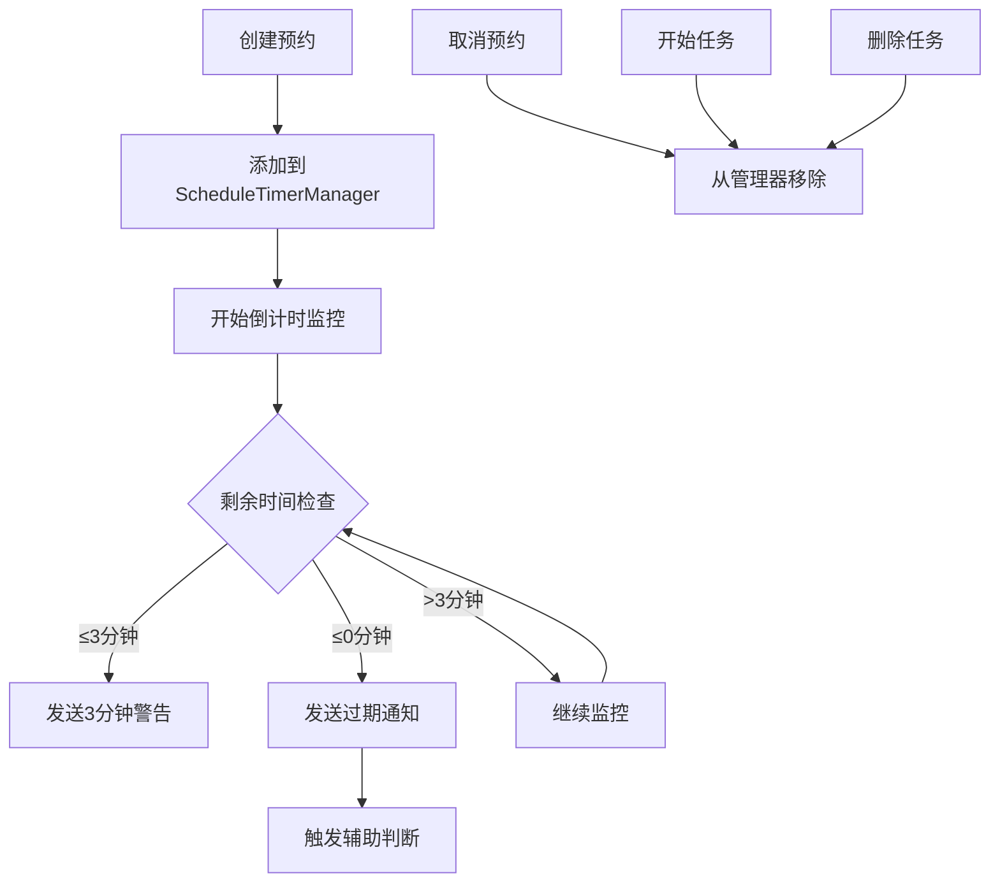

# 预约提醒功能说明

## 功能概述

新增了预约时间到期前3分钟的桌面提示功能，提供更好的任务预约管理体验。

## 功能特性

### 1. 3分钟提前警告
- 当预约时间剩余3分钟或更少时，自动发送桌面通知
- 通知标题：**预约即将到期**
- 通知内容：`"任务名称"预约还剩X分钟，请准备开始任务！`
- 通知需要用户交互（不会自动消失）

### 2. 过期提醒
- 当预约时间到期时，发送过期通知
- 通知标题：**预约失败**
- 通知内容：`"任务名称"预约时间已到期，需要进行规则判定`
- 自动触发辅助判断对话框

### 3. 智能计时管理
- 自动监控所有活跃的预约会话
- 每10秒检查一次状态，确保及时响应
- 自动清理过期的预约会话
- 防止重复通知（每个提醒只发送一次）

## 使用方法

### 启用桌面通知
1. 确保浏览器支持桌面通知功能
2. 在设置中启用"桌面通知"开关
3. 首次使用时会请求通知权限，请点击"允许"

### 创建预约
1. 在任务卡片上点击"预约"按钮
2. 系统会根据任务的预约时长创建预约会话
3. 预约会话开始倒计时

### 接收提醒
- **3分钟提醒**：在预约到期前3分钟内会收到提醒通知
- **过期提醒**：预约时间到期时会收到过期通知，并弹出辅助判断对话框

## 技术实现

### 核心组件

#### ScheduleTimerManager (`src/utils/scheduleTimer.ts`)
- 管理所有预约会话的倒计时
- 负责发送3分钟警告和过期通知
- 提供剩余时间查询和格式化功能

#### 通知增强 (`src/utils/notifications.ts`)
- 扩展了通知管理器
- 新增预约警告和过期通知方法
- 支持不同类型的通知需求

#### App.tsx 集成
- 在应用启动时初始化计时器管理器
- 在创建/取消/删除预约时同步更新计时器
- 处理过期回调和状态管理

### 数据流程



## 测试功能

### 开发环境测试
在浏览器控制台中执行以下命令进行测试：

```javascript
// 测试3分钟提醒和过期通知
testScheduleReminder()
```

测试会创建两个测试任务：
1. 2分钟后过期的任务（立即触发3分钟提醒）
2. 30秒后过期的任务（测试过期通知）

### 生产环境验证
1. 创建一个预约时长为4分钟的任务
2. 进行预约
3. 等待1分钟，应该收到3分钟提醒
4. 等待到预约时间结束，应该收到过期通知

## 配置说明

### 通知时机
- **3分钟警告**：剩余时间 ≤ 180秒时触发
- **过期通知**：剩余时间 ≤ 0秒时触发

### 检查频率
- 计时器每10秒检查一次所有预约状态
- 确保及时响应，但不会过度消耗资源

### 通知行为
- 3分钟警告：需要用户交互，不会自动消失
- 过期通知：需要用户交互，不会自动消失
- 点击通知会聚焦到应用窗口

## 兼容性

### 浏览器支持
- Chrome 22+
- Firefox 22+
- Safari 6+
- Edge 14+

### 功能依赖
- 需要用户授权桌面通知权限
- 需要启用应用的通知设置
- 依赖浏览器的Notification API

## 注意事项

1. **权限要求**：首次使用需要用户授权通知权限
2. **浏览器标签页**：即使标签页在后台，通知仍会正常发送
3. **系统设置**：确保操作系统允许浏览器发送通知
4. **网络状态**：功能不依赖网络连接，本地计时
5. **时间准确性**：基于系统时间，确保系统时间准确

## 故障排除

### 通知不显示
1. 检查浏览器通知权限是否已授权
2. 检查应用内通知设置是否已启用
3. 检查操作系统通知设置
4. 确认浏览器支持Notification API

### 时间计算错误
1. 检查系统时间是否准确
2. 确认预约时长设置正确
3. 检查浏览器控制台是否有错误信息

### 重复通知
- 系统已设计防重复机制，每个提醒只会发送一次
- 如果出现重复，可能是浏览器或系统问题

## 更新日志

### v1.0.0 (2024-12-19)
- ✅ 实现预约时间3分钟提前提醒功能
- ✅ 实现预约过期通知功能
- ✅ 集成到现有预约系统
- ✅ 添加测试工具和文档
- ✅ 支持智能计时管理和状态监控
